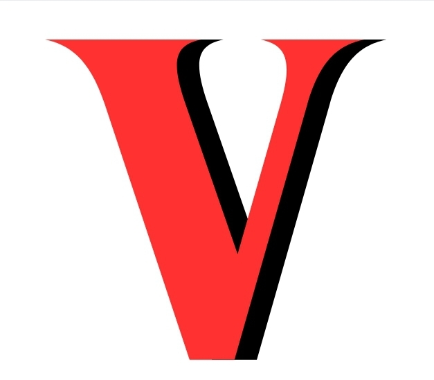
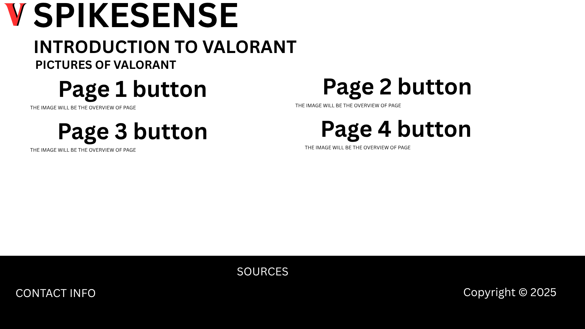
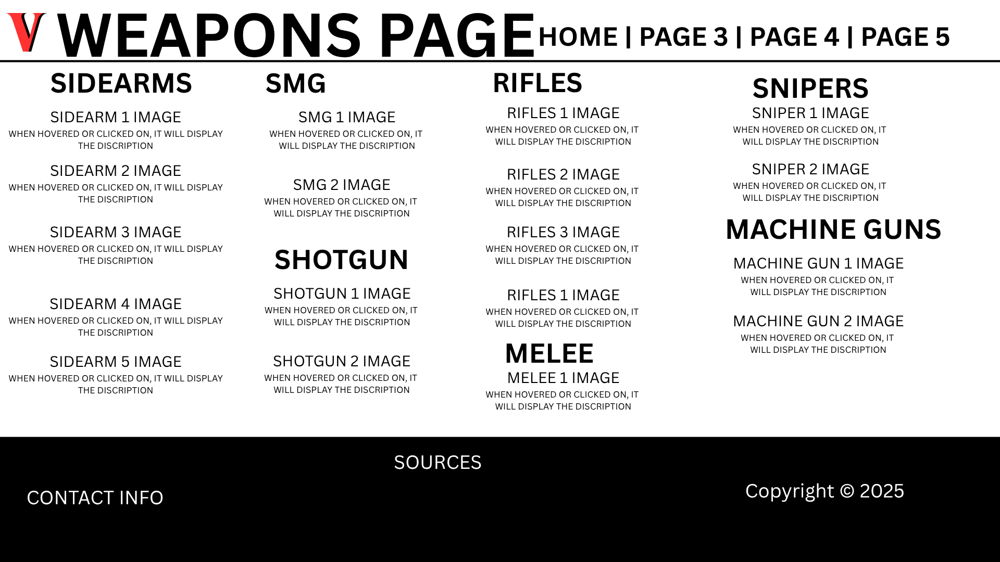
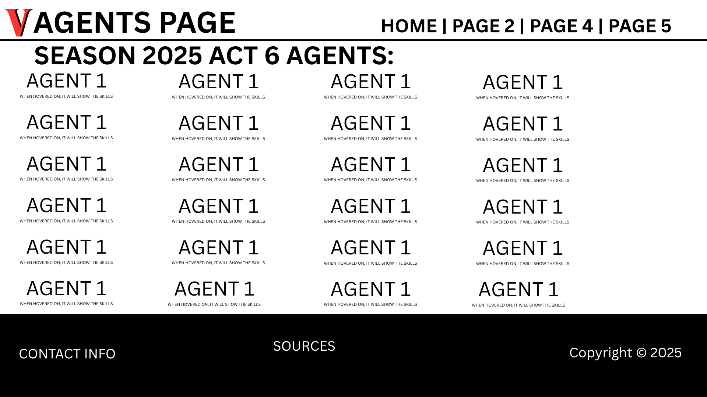
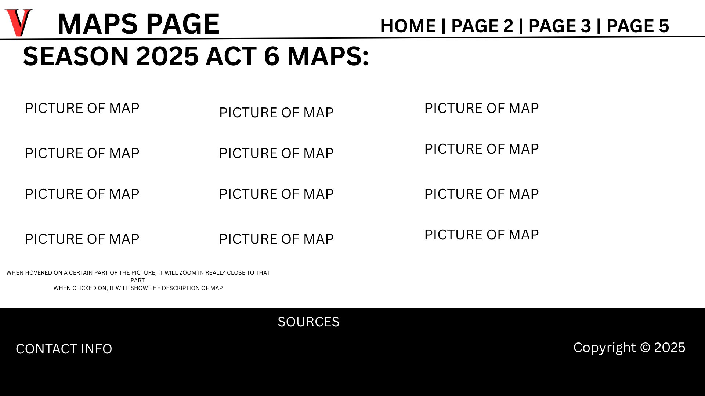
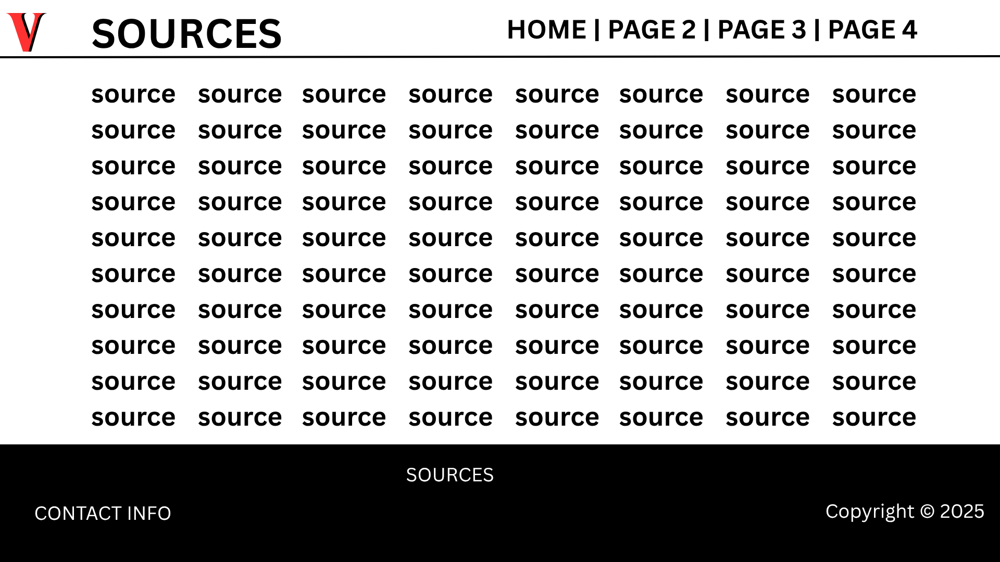

# SpikeSense 

## A comprehensive guide for Valorant
---
Logo: \

---
 Description: 
This is a website that aims to help players that are new to Valorant better understand the game. It contains useful information on the Weapons, Characters, and other core factors in the game. It serves as complement to the in-game tutorial, which teaches about game mechanics and controls, teaching new players about other things that are not explicitly stated. By using interactive-visuals, beginner-friendy explanations, and accurate information, we pursue a better learning experience for new players.

---
 Pages:  

Homepage -

P1 (Weapons) - Page that containsimages of the different guns and weapons of Valorant which you can click to see their use and descriptions.

P2 (Agents)  - Page that shows the names of the 'Agents' or characters of valorant in boxes arranged in rows and columns which you can click to see information about them.

P3 (Maps) - Images and layout of the maps in Valorant arranged in rows and columns, which can be clicked to see information for each map.

P4 (Sources) - Collection of all links and citations of all the assets and text used.

---
 How JS will be applied:  
Homepage: Special animations when hovering over the buttons that lead to the other pages.
Page 1: A box with an animation that appears for each weapon icon/image clicked, containing information.
Page 2: Cards of information that appear when clicking on an icon that corresponds to the character. 
Page 3: Zoom-in feature when hovering over certain parts of the images of the maps. When images are clicked, box that pushes the other images aside appears and displays information.
All Pages: When scrolling past the content, footer will pop out, showing sources.
---
Homepage: \

First Page:\

Second Page:\

Third Page:\

Fourth Page:\
