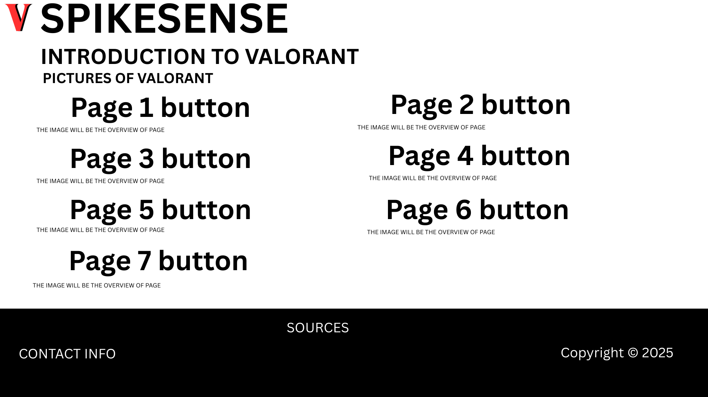
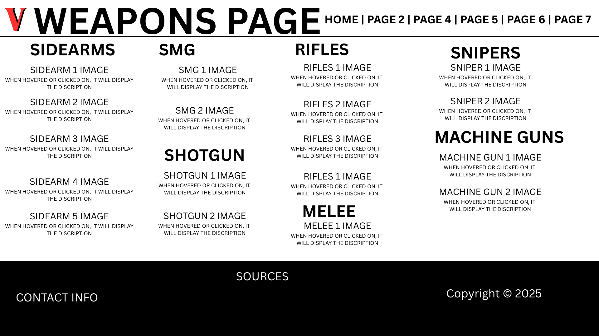
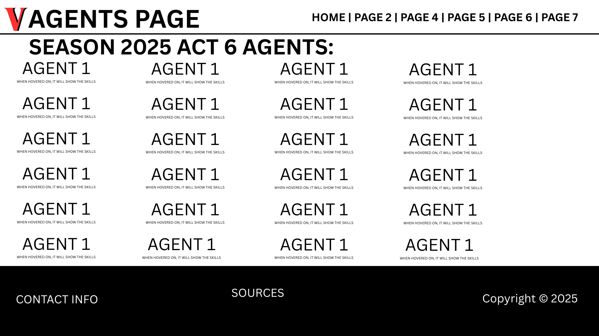
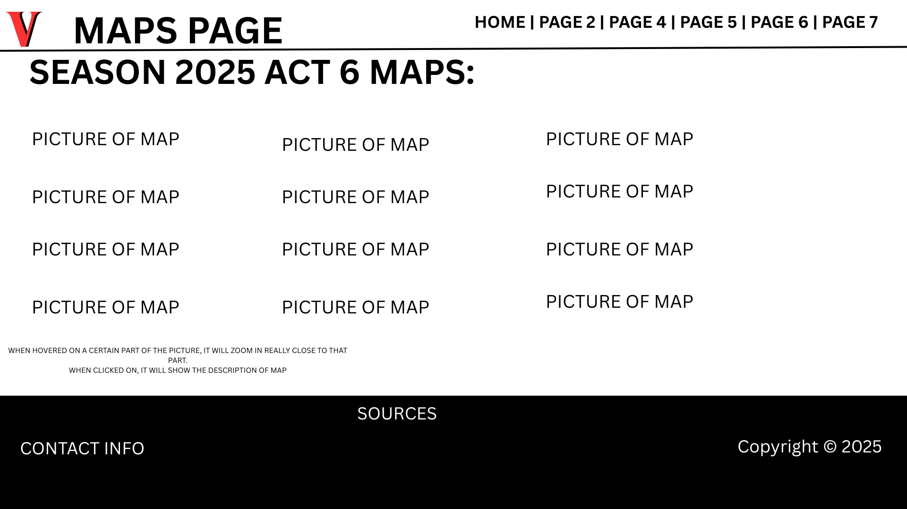
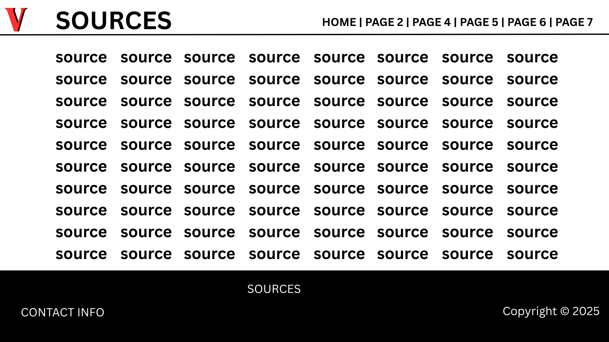
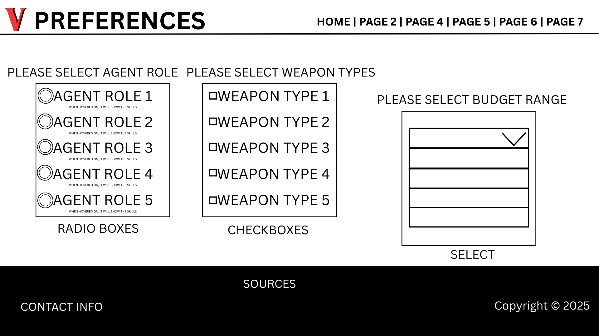
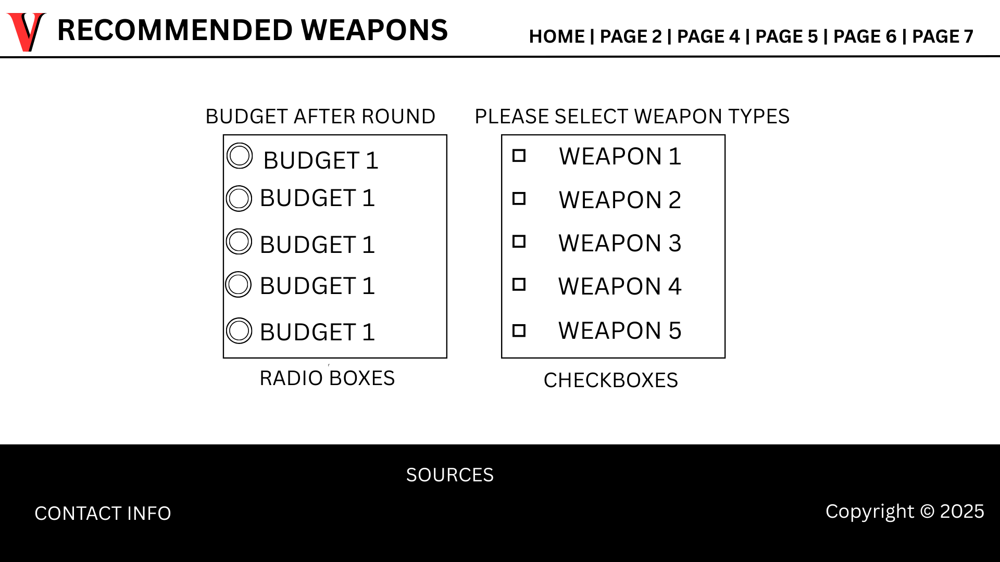
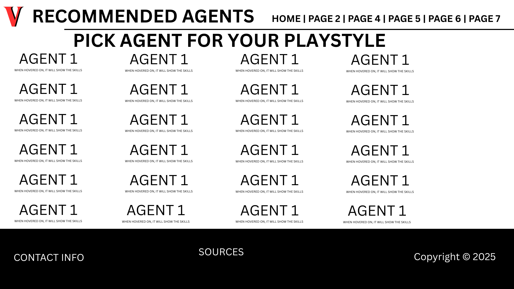

# SpikeSense 

## A comprehensive guide for Valorant
---
Logo: \

---
 Description: 
This is a website that aims to help players that are new to Valorant better understand the game. It contains useful information on the Weapons, Characters, and other core factors in the game. It serves as complement to the in-game tutorial, which teaches about game mechanics and controls, teaching new players about other things that are not explicitly stated. By using interactive-visuals, beginner-friendy explanations, and accurate information, we pursue a better learning experience for new players.

---
 Pages:  

Homepage - Page that connects to all the other pages, 4 buttons that open each page.

P1 (Weapons) - Page that contains images of the different guns and weapons of Valorant which you can click to see their use and descriptions.

P2 (Agents)  - Page that shows the names of the 'Agents' or characters of valorant in boxes arranged in rows and columns which you can click to see information about them.

P3 (Maps) - Images and layout of the maps in Valorant arranged in rows and columns, which can be clicked to see information for each map.

P4 (Log in Page)  - In this page, user will select their preffered Agent role, weapon type, and budget range, all in a box in the middle. HTML forms will be used here. buttons for Agent role, checkboxes for weapon type, dropdown or slider for budget range. The checked boxes will be highlighted in each page for example, the checked box is the agent you want, the agent selected will be highlighted.

P5 (Reccomended Weapons) - Shows reccomended weapons and the best ones to buy for the budget range. In a grid pattern from most expensive to least expensive. The checked boxes will be highlighted in each page for example, the checked box is the weapon you got reccomended, the weapon selected for you will be highlighted.

P6 (Reccomended Agents) - Shows reccomended Agents for the selected role, displaying image cards for agents in a grid. The checked boxes will be highlighted in each page for example, the checked box is the agent you got reccomended to your playstyle, the agent selected for you will be highlighted.

P7 (Sources) - Collection of all links and citations of all the assets and text used.

---

 How HTML form will be used  \
Page 5: To pick agent role, radio buttons will be used. Checkboxes for weapon type, and select element for budget range. 

Data will be saved using "submit" form tag, a button that will call to a js script that will save the selected elements' values using localStorage. \
Using localStorage.getItem, we can get the saved variables from the Preference page and their values.

---

 How JS will be applied:  \
Homepage: Special animations when hovering over the buttons that lead to the other pages. \
Page 1: A box with an animation that appears for each weapon icon/image clicked, containing information. \
Page 2: Cards of information that appear when clicking on an icon that corresponds to the character. \
Page 3: Zoom-in feature when hovering over certain parts of the images of the maps. When images are clicked, box that pushes the other images aside appears and displays information. \
All Pages: When scrolling past the content, footer will pop out, showing sources. 
---
Homepage: \

First Page:\

Second Page:\

Third Page:\

Fourth Page:\

Fifth Page:\

Sixth Page:\

Seventh Page:\
